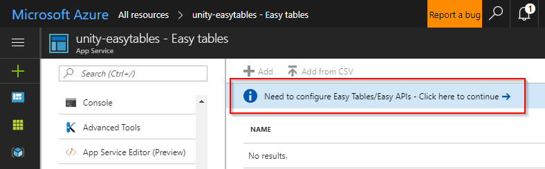
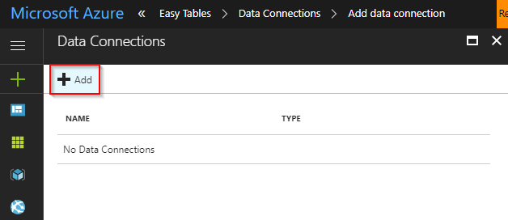
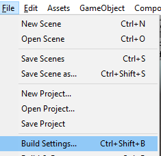

# Using Azure Easy Tables with Unity Walkthrough


## Introduction

Azure provides a scalable solution to storing telemetry and other game data in the cloud. With the release of Unity 2017, Unity's experimental support for .NET 4.6 makes Azure integration simpler than ever.

These steps will walk through the process of setting up a Unity project that leverages Azure for saving telemetry and leaderboard data in the cloud.  The completed project is available on [GitHub](TODO). However, the walkthrough will assume you are starting from an empty, new project and will provide links to download assets when necessary.

> [!NOTE]
> This project requires the "experimental" .NET 4.6 Mono scripting runtime in Unity 2017. [Unity has stated that soon this will be the default](https://forum.unity3d.com/threads/future-plans-for-the-mono-runtime-upgrade.464327/), however for now, it is still labeled as "experimental" and you may  experience issues.

> We will be using an experimental Azure Mobile Client SDK in this tutorial, and, as such, this may not build and run on every single Unity platform.  Please see the [SDK article](sandbox/gamedev/unity/azure-mobile-apps-unity) for a list of known working platforms.

## Configure Easy Tables in Azure

Easy Tables are a feature of [Azure Mobile Apps](https://azure.microsoft.com/services/app-service/mobile/) that allow setup and management of SQL tables directly in the Azure portal GUI. Azure Mobile Apps support many features, but the scope of this example is limited to reading and writing data stored in an Azure Mobile App backend from a Unity project.

### Create a new Azure Mobile App

Log in to the [Azure portal](https://ms.portal.azure.com). If you do not have an Azure subscription, the [free trial](https://azure.microsoft.com/en-us/free/) or included credits from [Visual Studio Dev Essentials](https://www.visualstudio.com/dev-essentials/) will more than suffice for completing this walkthrough.

**Once inside the portal:**

1. Select **New > Web + Mobile > Mobile App > Create**.

  

1. Configure the new Mobile App:
   * **App Name**. This will build the URL used to connect to the Azure Mobile App backend. You must choose a unique name, indicated by the green checkmark.
   * **Subscription**. Choose the subscription the new Mobile App will use for billing.
   * **Resource Group**. Resource groups allow easier management of related resources. By default Azure creates a new resource group with the same name as the new app. The default setting works well for the walkthrough.
   * **App Service Plan/Location**. The service plan dictates the computing power, location, and cost of the resources Azure uses to host your new Mobile App. By default Azure will create a new service plan with some default settings. This is the simplest option for this walkthrough. However, you can use this menu to customize a new service plan's pricing tier or geographic location. Additionally, settings for a service plan can be modified after deploying it.

   

1. Select **Create** and give Azure a few minutes to deploy the new resource. You will see a notification in the Azure Portal when deployment has completed.

### Add a new data connection

1. Once deployment has completed, click the **All resources** button and then select the newly created Mobile App.

   

1. In the newly opened blade, scroll down in the left side-menu and click the **Easy Tables** button, listed under the **MOBILE** heading.

   

1. Click the blue **Need to configure Easy Tables/Easy APIs** notice displaying along the top of the Easy Tables blade.

   

1. Click the notice that says **You need a database to use Easy Tables. Click here to create one**.

   

1. On the Data Connections blade, click the **Add** button.

   

1. On the Add a data connection blade, select **SQL Database**.

   

1. A blade will open for configuring a new SQL database and SQL server:
   * **Name**. Enter a name for the database.
   * **Target server**. Click **Target server** to open the New server blade.
     * **Server name**. Enter a name for the server.
     * **Server admin login and Password**. Create a username and password for the server admin.
     * **Location**. Choose a nearby location for the server.
     * Ensure that the **Allow azure services to access server** checkbox remains checked.
     * Click **Select** to complete configuration the server.
   * **Pricing tier**. Leave the default setting for the walkthrough. This can be modified later.
   * **Collation**. Leave the default setting.
   * Click **Select** to complete configuration of the database.

   

1. Back at the Add data connection blade, click **Connection String**. When the Connection string blade appears, leave the default settings and click **OK**.

   

1. Back at the Add data connection blade, the text "MS_TableConnectionString" should no longer be in italics. Click **OK** and give Azure a few minutes to create the new data connection. A notification will arrive when the process is complete.

   

### Complete the Easy Table initialization

1. Once the new data connection has been created successfully, click the **All resources** button, and again navigate back to the Mobile App. It is important to complete this step to refresh the Easy Table configuration notice.

1. Scroll down and select **Easy Tables**, and once more select the blue **Need to configure Easy Tables/Easy APIs** notice.

   

1. This time the blade that appears should state that "You already have a data connection" below the **1** heading. Under the **2** heading, click the checkbox that says **I acknowledge that this will overwrite site contents.** Now click **Initialize App** and wait a few minutes for Azure to complete the initialization process. A new notification will announce when the process is complete.

   

## Create Easy Tables

Now that you have a Mobile App on Azure with Easy Tables initialized, it's time to build the tables that will keep track of data sent from a Unity game.

### Setup the crash heatmap table

1. In the Azure portal, click All resources and then select the Mobile App that you configured for Easy Tables in the previous steps.

   

1. Scroll down to the **MOBILE** heading and select **Easy Tables**. There should no longer be any notice about initializing your app for Easy Tables.  

   

1. Click the **Add** button.

   

1. Name the table "**CrashInfo**" and click **OK**. Leave the rest of the options with their default settings.

   > [!WARNING]
   > This name must match the name of the data model class created later in the walkthrough.

   

1. A notification will announce when the new table has been created.

> [!NOTE]
> With Easy Tables, the table schema is actually dynamically created as data is added. This means appropriate data columns do not have to be manually set up during this step.

### Setup the leaderboard table

1. Go back to the Easy Tables blade and click **Add** to add a second table.

   

1. Name the new table "**HighScoreInfo**" and click **OK**. Leave the rest of the options at their default settings.

   > [!WARNING]
   > This name must match the name of the data model class created later in the walkthrough.

   

1. A notification will announce when the new table has been created.

## Prepare the development environment

There are some prerequisites to using the exerpimental Azure Mobile Client SDK in Unity.

### Download and install Unity 2017

Unity 2017.1 or above is required. All Unity plans work with the walkthrough, including the free Personal plan. Download Unity from https://store.unity.com/.

### Download and install Visual Studio 2017

The walkthrough requires Visual Studio 2017 15.3 and above, with the game development with Unity workload. All editions of Visual Studio 2017 work with the walkthrough, including the free Community edition.

1. Download Visual Studio 2017 at https://www.visualstudio.com/.

1. Install Visual Studio 2017 and ensure that the **Game development with Unity** workload is enabled.

   

   > [!NOTE]
   > If Visual Studio 2017 is already installed, you can view and modify workloads by running the Visual Studio Installer.

### Create a new 3D Unity project

Launch Unity and create a new 3D project.


### Set the script editor to Visual Studio Preview 2017

It's possible that you already have Visual Studio 2017 set as Unity's external script editor, but it's important to ensure the 15.3 Preview version is selected.

1. From the Unity **Edit** menu, choose **Edit > Preferences...**.

   

1. When the Unity Preferences window pops up, select the **External Tools** tab on the left side.

1. In the **External Script Editor** dropdown menu, select **Visual Studio 2017**.

   

### Change the Unity scripting runtime to .NET 4.6

The walkthrough requires .NET 4.6 in order to use the Azure Mobile Client SDK and its dependencies.

1. From the Unity **File** menu, choose **File > Build Settings...**.

   

1. Click the **Player Settings...** button.

   

1. The Player Settings opens in the Unity Inspector window. Under the **Configuration** heading, click the **Scripting Runtime Version** dropdown and select **Experimental (.NET 4.6 Equivalent)**. This will prompt a dialog asking to restart Unity. Select **Restart**.

   

### Imort the Mobile Apps SDK

**TODO**

## Create data model classes

The Unity project must contain data model classes that correspond with the tables created in the Azure Mobile App backend.

### Create the CrashInfo class

1. In Unity, add a new folder in the root **Assets** directory named **Scripts**. Inside of the new Scripts folder, create another new folder named **Data Models**. This is for organization only.

1. Inside the new Data Models folder, create a new C# script called **CrashInfo**.

1. Open the new `CrashInfo` script, delete any template code, including the class declaration and using statements, and add the following:

   ```csharp
   public class CrashInfo
   {
        public string Id { get; set; }
        public float X { get; set; }
        public float Y { get; set; }
        public float Z { get; set; }
   }
   ```

  > [!WARNING]
  > For the walkthrough to work correctly, the name of the data model class must match the name of the Easy Table created on the Azure Mobile App backend.

### Create the HighScoreInfo class

1. Inside the Data Models folder, create a new C# script called **HighScoreInfo**.

1. Open the new `HighScoreInfo` script, delete any template code, including the class declaration and using statements, and add the following:

   ```csharp
   public class HighScoreInfo
   {
        public string Name { get; set; }
        public float Time { get; set; }
        public string Id { get; set; }
   }
   ```
## Implement the Azure MobileServiceClient

Central to the Azure Mobile Client SDK is the [MobileServiceClient](TODO), which allows access to your Mobile App backend.

### Locate the URL of the Mobile App backend

The `MobileServiceClient` constructor takes the Mobile App URL as a parameter, so before going forward, locate the URL.

1. In the Azure portal, click the **App Services** button.

   

1. Click the entry for your Mobile App.

   

1. Copy the URL of your Mobile App backend.

   

### Create the MobileServiceClient singleton

There should only be a single instance of `MobileServiceClient`, so the walkthrough uses a variation of the singleton pattern.

1. Inside of the **Assets/Scripts** directory of your Unity project, create a new C# script named **AzureMobileServiceClient**.

1. Open the `AzureMobileServiceClient` script and delete any existing template code, including using statements and the class declaration.

1. Add the following code:

   ```csharp
   using Microsoft.WindowsAzure.MobileServices;
 
   public static class AzureMobileServiceClient
   {
        private const bool ignoreTls = true;
        private const string backendUrl = "MOBILE_APP_URL";
        private static MobileServiceClient client;
 
        public static MobileServiceClient Client
        {
            get
            {
                if (client == null)
                    client = new MobileServiceClient(backendUrl);
 
                return client;
            }
        }
   }
   ```

  > [!NOTE]
  > If IntelliSense does not recognize the Microsoft.WindowsAzure namespace, check that you have completed all of the steps in the [Prepare the development environment](TODO) section.

1. In the preceding code, replace `MOBILE_APP_URL` with the URL of your Mobile App backend.

## Test the client connection

Now that the AzureMobileServiceClient singleton is created, it's time to test the client connection.

### Create the TestClientConnection script

1. Inside the **Scripts** folder in Unity, create a new C# script called **TestClientConnection**.

1. Open the script in Visual Studio, delete any template code, and add the following:

  ```csharp
  using System.Collections.Generic;
  using UnityEngine;
  using System.Threading.Tasks;
  using System;
  using System.Linq;
  using Microsoft.WindowsAzure.MobileServices;

  public class TestClientConnection : MonoBehaviour
  {
      void Start()
      {
          Task.Run(TestTableConnection);
      }

      private async Task TestTableConnection()
      {
          var table = AzureMobileServiceClient.Client.GetTable<CrashInfo>();

          Debug.Log("Testing ToListAsync...");
          await TestToListAsync(table);

          Debug.Log("Testing InsertAsync...");
          await TestInsertAsync(table);

          Debug.Log("Testing DeleteAsync...");
          await TestDeleteAsync(table);

          Debug.Log("All testing complete.");
      }

      private async Task TestInsertAsync(IMobileServiceTable<CrashInfo> table)
      {
          try
          {
              var allEntries = await TestToListAsync(table);
              var initialCount = allEntries.Count();

              await table.InsertAsync(new CrashInfo { X = 1, Y = 2, Z = 3 });

              allEntries = await TestToListAsync(table);
              var newCount = allEntries.Count();

              Debug.Assert(newCount == initialCount + 1, "InsertAsync failed!");
          }
          catch (Exception)
          {
              throw;
          }
      }

      private async Task<List<CrashInfo>> TestToListAsync(IMobileServiceTable<CrashInfo> table)
      {
          try
          {
              var allEntries = await table.ToListAsync();
              Debug.Assert(allEntries != null, "ToListAsync failed!");
              return allEntries;
          }
          catch (Exception)
          {

              throw;
          }
      }

      private async Task TestDeleteAsync(IMobileServiceTable<CrashInfo> table)
      {
          var allEntries = await TestToListAsync(table);

          foreach (var item in allEntries)
          {
              try
              {
                  await table.DeleteAsync(item);
              }
              catch (Exception)
              {
                  throw;
              }
          }

          allEntries = await TestToListAsync(table);

          Debug.Assert(allEntries.Count() == 0, "DeleteAsync failed!");
      }
  }
  ```

1. In the Unity **GameObject** menu, select **GameObject > Create Empty** to create an empty GameObject in the Unity scene. Rename it **TestClientConnection**.

1. **Drag** the TestClientConnection script from the Unity **Project** window onto the TestClientConnection GameObject in the **Hierarchy** window.

1. In the Unity menu, select **File > Save Scene as...**. Name the scene **Client Connection Test** and click **Save**.

1. Click the **Play** button in Unity and observe the Console window. Confirm that none of the assertions have failed.

1. Open the CrashInfo Easy Table on the Azure portal. It should now have an entry with **X,Y,Z** coordinates of **(1, 2, 3)** and a value of **true** for in the **deleted** column. Each time you run the test, a new entry with the same values but a unique ID should be added to the table.

  

## Import sample game assets

Now that the core functionality has been tested and demonstrated to work, it's time to import the sample game assets.

### Import package

1. Download the [sample game assets package](TODO).

1. Ensure your Unity project is open, then navigate to the download location and double click the file. This will bring up the import dialog in Unity.

1. Click **All** and then click **Import**. Wait for the resulting progress bars to complete.

   

### Add scenes to Build Settings

Once the files have completed importing, the required scene files must be added in the Unity project's Build Settings.

1. In the Unity Project window, navigate to the **Azure Easy Tables sample game assets/Scenes** directory.

1. From the Unity menu, select **File > Build Settings...**. This will display the Build Settings dialog.

1. Drag the **HeatmapScene**, **LeaderboardScene**, **MenuScene**, and **RaceScene** files from the Project window into the **Scenes In Build** section of the Build Settings dialog.

   

1. From the Unity menu, select **File > Save Project** to ensure the build settings are saved.

## Test the sample game

The sample game is a simple racing game that records data about the player's behavior and stores it in Azure Easy Tables. The sample game also includes scenes that read the data from Azure and visualize it for the player.

This section will simply explain how to play the sample game and ensure it's functioning correctly. The next sections will go into more detail explaining how the sample game works.

### Starting the game

1. In the Unity Project window, navigate to the **Assets/Azure Easy Tables sample game assets/Scenes** folder.

1. Double click the **MenuScene** to open it.

1. In the Unity Game window, click the **aspect ratio dropdown** and choose **16:9**.

   

1. Click the **Play** button to run the game in the Unity editor.

### Complete a race

Before viewing the leaderboard or heatmap, it's best to create some sample data by completing the race at least once.

1. With the game running in the Unity editor, click the **Race!** button to start a new race.

1. Use **WASD** or the **arrow keys** to drive the car and complete a clockwise lap around the track. For the sake of example, be sure to crash into some walls along the way. Debug output in the Unity console should indicate when a collision has been recorded.

   >[!NOTE]
   > If you manage to flip the car and are unable to continue, click **Restart**. Data is only sent to Azure upon completing a lap.

   

1. After crossing the checkered finish line, the game should display a **Finished** message. At this point, crash data will be uploaded to Azure.

1. If you have completed one of the top 10 fastest lap times, you will be prompted to enter a name for a high score. Enter your name and click **Submit**.

   

### View the heatmap

1. Click the **View Crash Heatmap** button from the race scene or select **Crash Heatmap** from the main menu.

1. The heatmap scene loads data from the CrashInfo table in Azure and displays a transparent red sphere at locations where players have collided with the walls of the race track. If multiple crashes occur in an overlapping area, the spheres should appear brighter.

   

### View the leaderboard

1. Click the **Leaderboard** button from the race scene or main menu.

1. The leaderboard scene loads high score data from the HighScoreInfo table in Azure and displays a player name and lap time for each high score entry.

   

## RaceScene explanation

The RaceScene uses Unity [Standard Assets](https://www.assetstore.unity3d.com/en/#!/content/32351) to compose the basic racing gameplay and level.

### RecordCrashInfo

This script checks for crashes in `OnCollisionEnter` and records them to a list. `crashRecordingCooldown` and `crashRecordingMinVelocity` limit what the game considers a crash in order to keep a relevant data set.

When the `RaceFinished` event is raised, `UploadNewCrashDataAsync` sends each crash in the list to the CrashInfo Easy Table on Azure.

```csharp
using System.Collections;
using System.Collections.Generic;
using System.Threading.Tasks;
using UnityEngine;

public class RecordCrashInfo : MonoBehaviour
{
    [Tooltip("Time in seconds after a crash before a new crash can be recorded.")]
    [SerializeField]
    private float crashRecordingCooldown = 1;

    [Tooltip("How fast car must be traveling before crash can be recorded.")]
    [SerializeField]
    private float crashRecordingMinVelocity = 8;

    [SerializeField]
    private Rigidbody carRigidbody;

    [SerializeField]
    private GameObject crashMarkerPrefab;

    [Tooltip("If turned on, crash markers spawn when the player crashes.")]
    [SerializeField]
    private bool spawnDebugMarkers = false;

    private bool isOnCooldown = false;
    private bool meetsMinVelocity = false;
    private bool isRaceFinished = false;

    private List<CrashInfo> newCrashes = new List<CrashInfo>();

    private void LateUpdate()
    {
        // We have to update this in LateUpdate as opposed to checking in OnCollisionEnter.
        // The car's velocity has already decreased from crashing by the time
        // OnCollisionEnter gets called.

        meetsMinVelocity = carRigidbody.velocity.magnitude >= crashRecordingMinVelocity;
    }

    private void OnCollisionEnter(Collision collision)
    {
        if (!isRaceFinished && collision.gameObject.tag == "Wall" && !isOnCooldown && meetsMinVelocity)
        {
            Debug.Log("Collided with wall!");

            newCrashes.Add(new CrashInfo
            {
                X = collision.transform.position.x,
                Y = collision.transform.position.y,
                Z = collision.transform.position.z
            });

            if (spawnDebugMarkers && Debug.isDebugBuild)
                Instantiate(crashMarkerPrefab, collision.transform.position, Quaternion.identity);

            isOnCooldown = true;
            StartCoroutine(Cooldown());
        }  
    }

    private IEnumerator Cooldown()
    {
        yield return new WaitForSeconds(crashRecordingCooldown);

        isOnCooldown = false;
    }

    private void OnRaceFinished()
    {
        Task.Run(UploadNewCrashDataAsync);
    }

    private async Task UploadNewCrashDataAsync()
    {
        var crashTable = AzureMobileServiceClient.Client.GetTable<CrashInfo>();

        try
        {
            Debug.Log("Uploading crash data to Azure...");

            foreach (var item in newCrashes)
            {
                await crashTable.InsertAsync(item);
            }
            Debug.Log("Finished uploading crash data.");
        }
        catch (System.Exception e)
        {
            Debug.Log("Error uploading crash data: " + e.Message);
        }

    }

    private void OnEnable()
    {
        Checkpoint.RaceFinished += OnRaceFinished;
    }

    private void OnDisable()
    {
        Checkpoint.RaceFinished -= OnRaceFinished;
    }

}
```

## RecordHighScore

This script checks to see if the player has earned a new high score. If they have, it displays the `enterNamePopup`, which allows the player to enter their name and click **Submit**.

Once a player name is submitted, `UploadNewHighScoreAsync` is called and the new high score is sent to the HighScoreInfo Easy Table on Azure.

```csharp
using System.Collections;
using System.Collections.Generic;
using Microsoft.WindowsAzure.MobileServices;
using UnityEngine;
using System.Threading.Tasks;
using System;
using System.Linq;
using UnityEngine.UI;

public class RecordHighScore : MonoBehaviour
{
    [SerializeField]
    private InputField nameInputField;

    [SerializeField]
    private CanvasGroup enterNamePopup;

    private List<HighScoreInfo> highScores;
    private string playerName = string.Empty;

    private async void Start()
    {
        ShowEnterNamePopup(false);
        highScores = await Leaderboard.GetTopHighScoresAsync();
    }

    private void ShowEnterNamePopup(bool shouldShow)
    {
        enterNamePopup.alpha = shouldShow ? 1 : 0;
        enterNamePopup.interactable = shouldShow;
    }

    public void SubmitButtonClicked()
    {
        playerName = nameInputField.text;
    }

    private async void OnAfterMostRecentScoreSet(float newScore)
    {
        bool isNewHighScore = CheckForNewHighScore(newScore);

        if (isNewHighScore)
        {
            Debug.Log("New High Score!");
            await GetPlayerNameAsync();
            await UploadNewHighScoreAsync(newScore);
        }
        else
        {
            Debug.Log("No new high score.");
        }
    }

    private async Task GetPlayerNameAsync()
    {
        // Wait a bit before showing the popup.
        // This just helps the player experience feel
        // less jarring.
        await Task.Delay(2000);
        ShowEnterNamePopup(true);

        // Wait until the player enters a name and clicks submit.
        // OnSubmitButtonClicked will set the playerName.
        while (playerName == string.Empty)
        {
            await Task.Delay(100);
        }

        ShowEnterNamePopup(false);
    }

    private bool CheckForNewHighScore(float newScore)
    {
        Debug.Log("Checking for a new high score...");

        bool isHighScoreListFull = highScores.Count >= Leaderboard.SizeOfHighScoreList;
        var lowerScores = highScores.Where(x => x.Time > newScore);

        return lowerScores.Count() > 0 || !isHighScoreListFull;
    }

    private async Task UploadNewHighScoreAsync(float newScore)
    {
        var newHighScoreInfo = new HighScoreInfo { Name = playerName, Time = newScore };

        try
        {
            Debug.Log("Uploading high score data to Azure...");

            await Leaderboard.HighScoreTable.InsertAsync(newHighScoreInfo);

            Debug.Log("Finished uploading high score data.");
        }
        catch (System.Exception e)
        {
            Debug.Log("Error uploading high score data: " + e.Message);
        }
    }

    private void OnEnable()
    {
        LapTimer.AfterMostRecentScoreSet += OnAfterMostRecentScoreSet;
    }

    private void OnDisable()
    {
        LapTimer.AfterMostRecentScoreSet -= OnAfterMostRecentScoreSet;
    }

}
```

## HeatmapScene explanation

The HeatmapScene contains an instance of the **LevelGeometry** prefab. This way the coordinates for crashes loaded from Azure map correctly to the level art.

### InitializeCrashListAsync

`InitializeCrashListAsync` connects to the CrashInfo Easy Table on Azure and uses [ToListAsync](TODO) to add all of its entries to a list.

```csharp
private async Task InitializeCrashListAsync()
 {
     Debug.Log("Downloading crash data from Azure...");

     for (int i = 0; i < numberOfAttempts; i++)
     {
         try
         {
             Debug.Log("Connecting... attempt " + (i +1));
             crashesFromServer = await crashesTable.ToListAsync();
             Debug.Log("Done downloading.");
             return;
         }
         catch (System.Exception e)
         {
             Debug.Log("Error connecting: " + e.Message);
         }

         if (i == numberOfAttempts - 1)
             Debug.Log("Connection failed. Check logs, try again later.");
         else
             await Task.Delay(500);
     }
 }
```

### SpawnMarkersFromList
`SpawnMarkersFromList` iterates through the list of crashes received from Azure and instantiates a crash marker prefab for each entry.

```csharp
private void SpawnMarkersFromList()
{
    foreach (var item in crashesFromServer)
    {
        GameObject marker = GameObject.Instantiate(markerPrefab);
        marker.transform.position = new Vector3 { x = item.X, y = item.Y, z = item.Z };
    }
}
```

### DeleteCrashDataAsync

`DeleteCrashDataAsync` is called when the user presses the **Clear Data** button. It iterates through the local list of crashes and calls [DeleteAsync](TODO) for each entry. This sets each entry's **Deleted** column in the Easy Table to **true**. `ToListAsync` ignores these deleted entries.

```csharp
public async void DeleteCrashDataAsync()
{
    Debug.Log("Deleting crash data...");
    foreach (var item in crashesFromServer)
    {
        try
        {
            await crashesTable.DeleteAsync(item);
        }
        catch (System.Exception e)
        {
            Debug.Log("Error deleting crash data: " + e.Message);
        }
        Debug.Log("Done deleting crash data.");
    }
    SceneManager.LoadScene(SceneManager.GetActiveScene().name);
}
```

## LeaderboardScene explanation

The LeaderboardScene is composed of only UI. In the scene Hierarchy, **Alt + click** the **expand arrow** next to the Canvas GameObject to expand it and its child GameObjects. Nested below Canvas and Panel is the Leaderboard GameObject with the Leaderboard script attached.


## Leaderboard script

The `Leaderboard` class uses an `async Start` function, which is still called when the script is enabled, just like a typical Unity `Start` function.

`DownloadHighScoresAsync` uses the `OrderBy` and `Take` functions of [IMobileServiceTable](TODO) to sort the high scores in the Azure Easy Table and only take the top entries based on the `SizeOfHighScoreList` constant, which are stored in the `highScores` list.

Then an instance of the high score row UI prefab is instantiated for each entry in the list.

```csharp
using Microsoft.WindowsAzure.MobileServices;
using System.Collections.Generic;
using System.Threading.Tasks;
using UnityEngine;
using System;
using UnityEngine.UI;

public class Leaderboard : MonoBehaviour
{
    [SerializeField]
    private GameObject rowPrefab;

    [SerializeField]
    private Text loadingText;

    public const int SizeOfHighScoreList = 10;
    private static int numberOfAttemptsToLoadData = 3;
    private static IMobileServiceTable<HighScoreInfo> highScoreTable_UseProperty;

    public static IMobileServiceTable<HighScoreInfo> HighScoreTable
    {
        get
        {
            if (highScoreTable_UseProperty == null)
            {
                highScoreTable_UseProperty = AzureMobileServiceClient.Client.GetTable<HighScoreInfo>();
            }

            return highScoreTable_UseProperty;
        }
    }

    public static async Task<List<HighScoreInfo>> GetTopHighScoresAsync()
    {
            return await DownloadHighScoresAsync(true);
    }

    private static async Task<List<HighScoreInfo>> DownloadHighScoresAsync(bool onlyTopEntries)
    {
        List<HighScoreInfo> highScoreList;

        Debug.Log("Downloading high score data from Azure...");

        for (int i = 0; i < numberOfAttemptsToLoadData; i++)
        {
            try
            {
                Debug.Log("Connecting... attempt " + (i + 1));

                if (onlyTopEntries)
                {
                    highScoreList = await HighScoreTable
                        .OrderBy(item => item.Time)
                        .Take(SizeOfHighScoreList)
                        .ToListAsync();
                }
                else
                {
                    highScoreList = await HighScoreTable.ToListAsync();
                }

                Debug.Log("Done downloading high score data.");
                return highScoreList;
            }
            catch (Exception e)
            {
                Debug.Log("Error connecting: " + e.Message);
            }

            if (i == numberOfAttemptsToLoadData - 1)
                Debug.Log("Connection failed. Check logs, try again later.");
            else
                await Task.Delay(500);
        }

        // If we can't successfully download a list from the server,
        // just make a new one to fail more gracefully.
        return highScoreList = new List<HighScoreInfo>();
    }

    private async void Start()
    {
        var highScores = await GetTopHighScoresAsync();

        if (highScores.Count == 0)
        {
            ShowEmptyLeaderboardMessage();
        }
        else
        {
            loadingText.gameObject.SetActive(false);

            foreach (var item in highScores)
            {
                var row = Instantiate(rowPrefab, this.transform).GetComponent<LeaderboardRow>();
                row.HighScoreInfo = item;
            }
        }
    }

    private void ShowEmptyLeaderboardMessage()
    {
        loadingText.text = "The leaderboard is empty!";
    }

    public static async Task DeleteAllEntriesAsync()
    {
       Debug.Log("Deleting leaderboard data...");

        var fullHighScoreList = await DownloadHighScoresAsync(false);

        foreach (var item in fullHighScoreList)
        {
            try
            {
                await HighScoreTable.DeleteAsync(item);
            }
            catch (Exception e)
            {
                Debug.Log("Error deleting leaderboard data: " + e.Message);
            }
        }
    }
}
```
